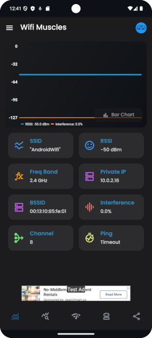
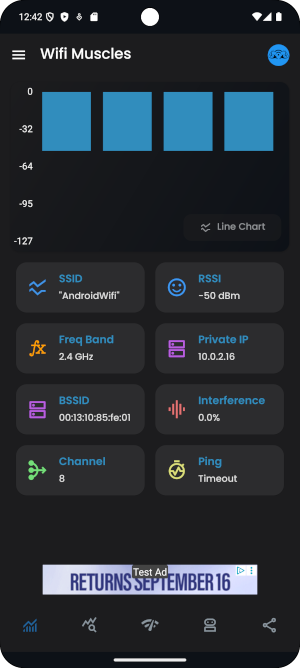
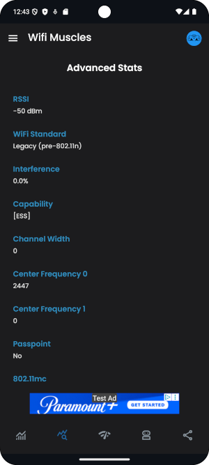
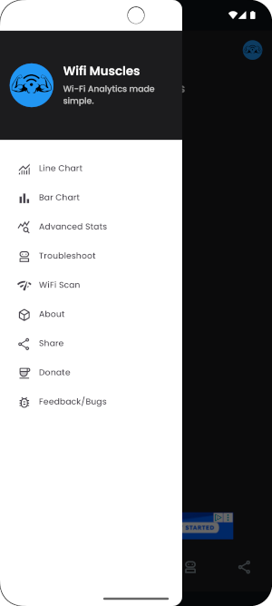

# WiFi Muscles 📶💪

## Overview

**WiFi Muscles** is a powerful Android app designed with simplicity in mind to give you insights into your Wi-Fi health. It's like a fitness tracker for Wi-Fi.

## Features
- Real-time Wi-Fi signal strength tracking with charts.
- Helpful network connection statistics.
- Interactive popups explaining each stat in more detail.
- Automatic refresh for live updates.
- Swipe to refresh surrounding networks list.
- Troubleshoot your Wi-Fi connection for common issues.
- Easy, simple navigation.

## Screenshots

## Usage
- Launch the app after downloading from the Google Play store to see a dashboard with Wi-Fi stats.
- Choose between line chart and bar chart live views on the dashboard.
- Monitor your Wi-Fi health and identify issues such as a poor signal.
- Great for learning where to place extenders/mesh nodes.
- Troubleshoot your Wi-Fi connection for common issues such as intermittency, weak signal, and more.

## Tech Stack
- **Language:** Java/Kotlin
- **Architecture:** MVVM with LiveData
- **Minimum API:** 21 (Android 5.0 Lollipop)
- **Libraries:** AndroidX, RecyclerView, Lifecycle components, MP Chart
